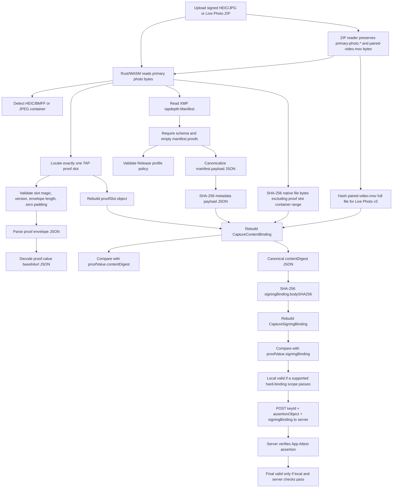

# Verification Flow

The verifier follows TAPCamDemo still-photo `content-binding:v2` and Live Photo
`content-binding:v3`. Still photos bind the native HEIC/JPG file bytes excluding
the fixed proof slot plus canonical TAP manifest payload JSON. Live Photos keep
that primary-photo binding and add the complete `paired-video.mov` bytes as a
signed resource. Verification is scoped: a full Live Photo package verifies the
primary photo and MOV, while a primary-only transfer can still verify the signed
Live Photo primary photo and submit the embedded signing binding to the server.
The browser does not decode RGB pixels, video frames, or metric depth Float32
values for the base signature.

## Hash Flow



## Implemented Checks

- HEIC/BMFF and JPEG container detection.
- BMFF `uuid` proof slot and JPEG APP11 proof slot location.
- Proof slot magic `TAPCAM-PROOF-SLOT-V1`, version `1`, envelope length, and
  zero-filled padding.
- Proof envelope JSON parse.
- `proof.value` base64url decode and JSON parse.
- XMP `tapdepth:Manifest` extraction, including element-style XMP and
  ImageIO/RDF attribute-style XMP.
- Exact TAP depth manifest schema check.
- Empty `manifest.proofs`; proof bodies must live in the fixed proof slot.
- Release capture profile policy:
  - HEIC uses requested codec `hvc1`;
  - JPEG uses requested codec `jpeg`;
  - depth delivery is enabled;
  - depth is embedded in the photo;
  - depth is filtered;
  - photo quality prioritization is `quality`.
- `assetHash`: SHA-256 over uploaded bytes excluding the proof slot container
  range.
- `metadataHash`: SHA-256 over canonical `manifest.payload` JSON.
- Rebuilt `CaptureContentBinding` equality.
- Live Photo `signedResources` checks for:
  - `primaryPhoto`;
  - `tapDepthManifestPayload`;
  - `pairedLivePhotoVideo` descriptor;
  - full `pairedLivePhotoVideo` bytes when MOV bytes are supplied and match.
- Rebuilt `CaptureSigningBinding` equality.
- `signingBindingSHA256` as a browser-recomputed diagnostic hash of the exact
  `signingBinding` sent to the server. If the server echoes the same field, the
  UI compares it to catch integration drift; this is not a server-side native
  file hash check.

## Scoped Verifier Rule

The verifier does not reclassify Live Photos as still photos. Unsupported
containers, missing slots, malformed padding, non-empty manifest proofs, profile
drift, primary-photo hash mismatch, manifest hash mismatch, malformed v3 signed
resource descriptors, or signing-binding mismatch produce `invalid`.

For Live Photo v2/v3 captures, the verifier reports one of two valid scopes:

- `fullLivePhoto`: the primary photo, manifest payload, paired MOV, embedded
  content digest, signing binding, and server App Attest verification passed.
- `primaryPhotoFromLivePhoto`: the primary photo and manifest payload match the
  embedded v3 content digest, the digest declares a paired MOV resource, and the
  embedded signing binding passes server App Attest verification, but
  `paired-video.mov` was missing or did not match. The UI must state that
  video/motion bytes were not verified.

There is no `blocked` state for RGB/depth decoding in the base signature path
because decoded pixels are not signature inputs. MOV-only input remains
unsupported because the TAP proof slot, manifest payload, assertion object, and
signing binding live in the primary HEIC/JPG.

## Server Boundary

The browser never uploads the original HEIC/JPG. After local hard-binding checks
pass, the page posts to:

```text
https://www.tapnap.net/tapcam/capture-signatures/verify
```

The request body is:

```json
{
  "keyId": "...",
  "assertionObject": "...",
  "signingBinding": {
    "bodySHA256": "...",
    "captureID": "...",
    "operation": "tapcam.capture.sign",
    "schemaID": "urn:tapnap:tapcam:app-attest-capture-signing:v1"
  }
}
```

The production page origin is `https://verifier.tapnap.net`. Local development
origins such as `http://127.0.0.1:4174` are expected to fail server verification
unless the server CORS allowlist includes them.

## Parallel Analysis And Verification

The browser resolves the selected input into primary photo bytes once, then runs
visual analysis and signature verification as independent async paths:

- Verification reads the proof slot, manifest, content binding, and server App
  Attest result, then updates the verification result panel.
- Analysis reads the same primary photo bytes for original preview, embedded
  depth/disparity decoding, and relative 3D point-cloud inspection.
- Missing `paired-video.mov` does not block verification. The verifier checks the
  remaining Live Photo primary-photo scope and continues to server verification
  when that scope passes.
- A failed signature result does not cancel already-running visual analysis.

The original preview, depth panel, and 3D point-cloud panel remain downstream
inspection tools. They are not inputs to the base signature verdict.
