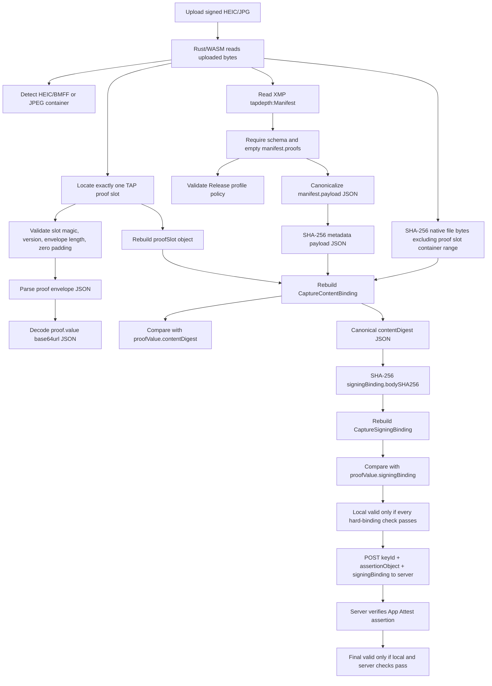

# Verification Flow

The verifier follows TAPCamDemo `content-binding:v2`. The signed base content is
the native HEIC/JPG file bytes excluding the fixed proof slot, plus canonical TAP
manifest payload JSON. The browser does not decode RGB pixels and does not
convert auxiliary depth to metric Float32 for the base signature.

## Hash Flow



## Implemented Checks

- HEIC/BMFF and JPEG container detection.
- BMFF `uuid` proof slot and JPEG APP11 proof slot location.
- Proof slot magic `TAPCAM-PROOF-SLOT-V1`, version `1`, envelope length, and
  zero-filled padding.
- Proof envelope JSON parse.
- `proof.value` base64url decode and JSON parse.
- XMP `tapdepth:Manifest` extraction.
- Exact TAP depth manifest schema check.
- Empty `manifest.proofs`; proof bodies must live in the fixed proof slot.
- Release capture profile policy:
  - HEIC uses requested codec `hvc1`;
  - JPEG uses requested codec `jpeg`;
  - depth delivery is enabled;
  - depth is embedded in the photo;
  - depth is filtered;
  - photo quality prioritization is `quality`.
- `assetHash`: SHA-256 over uploaded bytes excluding the proof slot container
  range.
- `metadataHash`: SHA-256 over canonical `manifest.payload` JSON.
- Rebuilt `CaptureContentBinding` equality.
- Rebuilt `CaptureSigningBinding` equality.
- `signingBindingSHA256` summary for server response comparison.

## Strict Verifier Rule

The verifier does not degrade. Unsupported containers, missing slots, malformed
padding, non-empty manifest proofs, profile drift, or any hash mismatch produce
`invalid`. There is no `blocked` state for RGB/depth decoding in the v2 base
signature path because decoded pixels are not signature inputs.

## Server Boundary

The browser never uploads the original HEIC/JPG. After local hard-binding checks
pass, the page posts to:

```text
https://www.tapnap.net/tapcam/capture-signatures/verify
```

The request body is:

```json
{
  "keyId": "...",
  "assertionObject": "...",
  "signingBinding": {
    "bodySHA256": "...",
    "captureID": "...",
    "operation": "tapcam.capture.sign",
    "schemaID": "urn:tapnap:tapcam:app-attest-capture-signing:v1"
  }
}
```

The production page origin is `https://verifier.tapnap.net`. Local development
origins such as `http://127.0.0.1:4174` are expected to fail server verification
unless the server CORS allowlist includes them.
