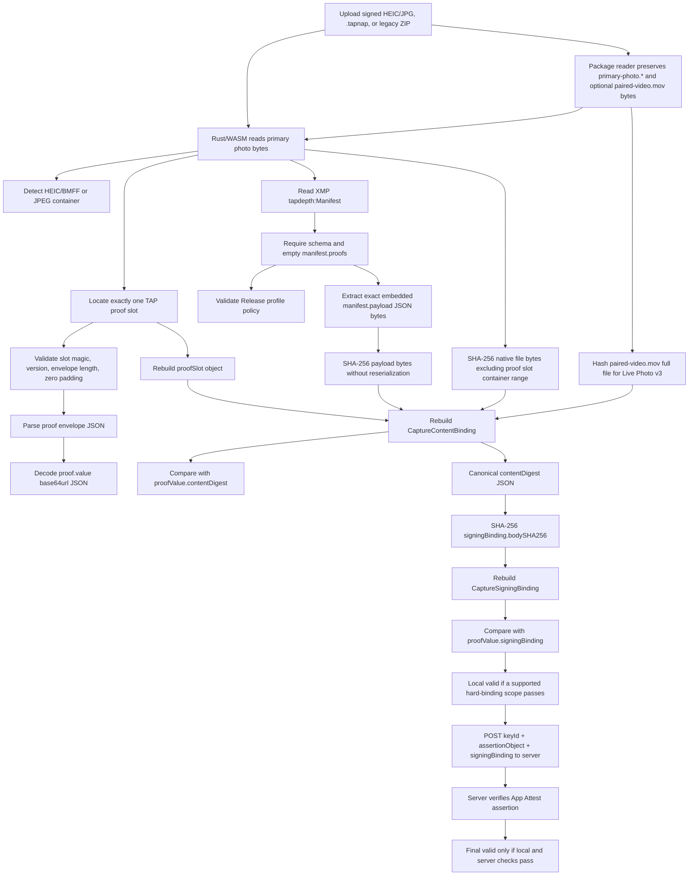

# Verification Flow

The verifier follows TAPCamDemo still-photo `content-binding:v2` and Live Photo
`content-binding:v3`. Still photos bind the native HEIC/JPG file bytes excluding
the fixed proof slot plus the exact TAP manifest payload JSON bytes embedded in
XMP. Live Photos keep that primary-photo binding and add the complete
`paired-video.mov` bytes as a signed resource. Verification is scoped: a full
Live Photo `.tapnap` or legacy ZIP package verifies the primary photo and MOV,
while a primary-only transfer can still verify the signed Live Photo primary
photo and submit the embedded signing binding to the server. The browser does
not decode RGB pixels, video frames, or metric depth Float32 values for the base
signature.

## Hash Flow


```mermaid
flowchart TD
    A["Upload signed HEIC/JPG, .tapnap, or legacy ZIP"] --> B["Rust/WASM reads primary photo bytes"]
    A --> Z["Package reader preserves primary-photo.* and optional paired-video.mov bytes"]
    Z --> B
    Z --> Y["Hash paired-video.mov full file for Live Photo v3"]
    B --> C["Detect HEIC/BMFF or JPEG container"]
    B --> D["Locate exactly one TAP proof slot"]
    D --> E["Validate slot magic, version, envelope length, zero padding"]
    E --> F["Parse proof envelope JSON"]
    F --> G["Decode proof.value base64url JSON"]
    B --> H["Read XMP tapdepth:Manifest"]
    H --> I["Require schema and empty manifest.proofs"]
    I --> J["Validate Release profile policy"]
    B --> K["SHA-256 native file bytes excluding proof slot container range"]
    I --> L["Extract exact embedded manifest.payload JSON bytes"]
    L --> M["SHA-256 payload bytes without reserialization"]
    D --> N["Rebuild proofSlot object"]
    K --> O["Rebuild CaptureContentBinding"]
    M --> O
    Y --> O
    N --> O
    O --> P["Compare with proofValue.contentDigest"]
    O --> Q["Canonical contentDigest JSON"]
    Q --> R["SHA-256 signingBinding.bodySHA256"]
    R --> S["Rebuild CaptureSigningBinding"]
    S --> T["Compare with proofValue.signingBinding"]
    T --> U["Local valid if a supported hard-binding scope passes"]
    U --> V["POST keyId + assertionObject + signingBinding to server"]
    V --> W["Server verifies App Attest assertion"]
    W --> X["Final valid only if local and server checks pass"]
```

## Capture Package Resolution

The preferred transport filename is `TAPNAP-Capture.tapnap`. Its identifiers
are UTI `net.tapnap.capture-package` and MIME
`application/vnd.tapnap.capture-package+zip`. The browser recognizes `.tapnap`,
the TAPNAP MIME, legacy `.zip` / `application/zip`, and ZIP magic; raw
HEIC/HEIF/JPG/JPEG input remains unchanged.

Both still and Live Photo packages use the existing
`urn:tapnap:tapcam:verification-export:v1` sidecar. The sidecar is an untrusted
resource index only. `packageKind` is informational and is limited by the
producer contract to `stillPhoto` or `livePhotoPackage`. Resource roles may
point the reader to a supported photo or MOV entry, but `packageKind`, declared
media types, and other sidecar fields cannot define the verification scope. If
the sidecar is absent, malformed, or maps a role to an unsupported entry, the reader falls back to
`primary-photo.heic|heif|jpg|jpeg` and `paired-video.mov`.

The resolved primary-photo bytes are passed unchanged to Rust/WASM. MOV bytes
are passed only when the package contains a paired video. Therefore a still
`.tapnap` package without a MOV follows the ordinary still-photo verification
path, while a signed Live Photo primary without a MOV follows the existing
`primaryPhotoFromLivePhoto` path. No TypeScript package metadata can reclassify
the signed media type.

Package parsing is bounded before extraction: oversized inputs, excessive ZIP
entries, oversized resources, and ambiguous primary-photo or paired-video
matches are rejected. Only the root sidecar and supported photo/MOV candidates
are materialized in browser memory.

## Implemented Checks

- HEIC/BMFF and JPEG container detection.
- BMFF `uuid` proof slot and JPEG APP11 proof slot location.
- Proof slot magic `TAPCAM-PROOF-SLOT-V1`, version `1`, envelope length, and
  zero-filled padding.
- Proof envelope JSON parse.
- `proof.value` base64url decode and JSON parse.
- XMP `tapdepth:Manifest` extraction, including element-style XMP and
  ImageIO/RDF attribute-style XMP.
- Exact TAP depth manifest schema check.
- Empty `manifest.proofs`; proof bodies must live in the fixed proof slot.
- Release capture profile policy:
  - HEIC uses requested codec `hvc1`;
  - JPEG uses requested codec `jpeg`;
  - depth delivery is enabled;
  - depth is embedded in the photo;
  - depth is filtered;
  - photo quality prioritization is `quality`.
- `assetHash`: SHA-256 over uploaded bytes excluding the proof slot container
  range.
- `metadataHash`: SHA-256 over the exact `manifest.payload` JSON bytes extracted
  from XMP after XML entity decoding. The verifier must not parse and
  reserialize the payload before hashing because that can change high-precision
  location number lexemes.
- Rebuilt `CaptureContentBinding` equality.
- Live Photo `signedResources` checks for:
  - `primaryPhoto`;
  - `tapDepthManifestPayload`;
  - `pairedLivePhotoVideo` descriptor;
  - full `pairedLivePhotoVideo` bytes when MOV bytes are supplied and match.
- Rebuilt `CaptureSigningBinding` equality.
- `signingBindingSHA256` as a browser-recomputed diagnostic hash of the exact
  `signingBinding` sent to the server. If the server echoes the same field, the
  UI compares it to catch integration drift; this is not a server-side native
  file hash check.

## Scoped Verifier Rule

The verifier does not reclassify Live Photos as still photos. Unsupported
containers, missing slots, malformed padding, non-empty manifest proofs, profile
drift, primary-photo hash mismatch, manifest hash mismatch, malformed v3 signed
resource descriptors, or signing-binding mismatch produce `invalid`.

For Live Photo v2/v3 captures, the verifier reports one of two valid scopes:

- `fullLivePhoto`: the primary photo, manifest payload, paired MOV, embedded
  content digest, signing binding, and server App Attest verification passed.
- `primaryPhotoFromLivePhoto`: the primary photo and manifest payload match the
  embedded v3 content digest, the digest declares a paired MOV resource, and the
  embedded signing binding passes server App Attest verification, but
  `paired-video.mov` was missing or did not match. The UI must state that
  video/motion bytes were not verified.

There is no `blocked` state for RGB/depth decoding in the base signature path
because decoded pixels are not signature inputs. MOV-only input remains
unsupported because the TAP proof slot, manifest payload, assertion object, and
signing binding live in the primary HEIC/JPG.

## Server Boundary

The browser never uploads the original HEIC/JPG. After local hard-binding checks
pass, the page posts to:

```text
https://www.tapnap.net/tapcam/capture-signatures/verify
```

The request body is:

```json
{
  "keyId": "...",
  "assertionObject": "...",
  "signingBinding": {
    "bodySHA256": "...",
    "captureID": "...",
    "operation": "tapcam.capture.sign",
    "schemaID": "urn:tapnap:tapcam:app-attest-capture-signing:v1"
  }
}
```

The production page origin is `https://verifier.tapnap.net`. Local development
origins such as `http://127.0.0.1:4174` are expected to fail server verification
unless the server CORS allowlist includes them.

## Parallel Analysis And Verification

The browser resolves the selected input into primary photo bytes once, then runs
visual analysis and signature verification as independent async paths:

- Verification reads the proof slot, manifest, content binding, and server App
  Attest result, then updates the verification result panel.
- Analysis reads the same primary photo bytes for original preview, embedded
  depth/disparity decoding, and relative 3D point-cloud inspection. The work may
  run while verification is still in flight.
- For valid signatures, the success modal is shown before the visual panes are
  revealed. The already-running analysis results become visible only after the
  modal auto-dismisses or the user clicks through it.
- Missing `paired-video.mov` does not block verification. The verifier checks the
  remaining Live Photo primary-photo scope and continues to server verification
  when that scope passes.
- A failed signature result does not cancel already-running visual analysis.

The original preview, depth panel, and 3D point-cloud panel remain downstream
inspection tools. They are not inputs to the base signature verdict.

## TAP Video Flow

Raw `.mp4` / `video/mp4` input takes the TAP Video path rather than the photo or
Live Photo package path. The browser requires exactly one
`TAPCAMVIDEOMANF1` UUID box and one fixed `TAPCAMPROOFSLOT1` UUID box, validates
the proof envelope and zero padding, hashes the full MP4 excluding exactly the
proof-slot box, hashes canonical manifest-v2 payload JSON, and compares the
reconstructed `content-binding:v4` and signing binding with the proof value.
The existing App Attest server endpoint receives only `keyId`,
`assertionObject`, and `signingBinding` after those local checks pass.

Video analysis is downstream of that hard-binding gate. The native browser
player renders RGB/audio while the verifier reads the manifest-selected MP4
metadata track's `stsz`, `stsc`, and `stco`/`co64` tables. Each Apple `mebx`
sample unwraps one KLV-v2 depth frame. Player time selects the nearest signed
depth timestamp, and seeks invalidate stale work. Raw and zstd1 frames are
decoded on demand with a two-frame cache. Video mode explicitly disables the
3D point-cloud pane; it does not reinterpret a time series as a still-photo
point cloud.
